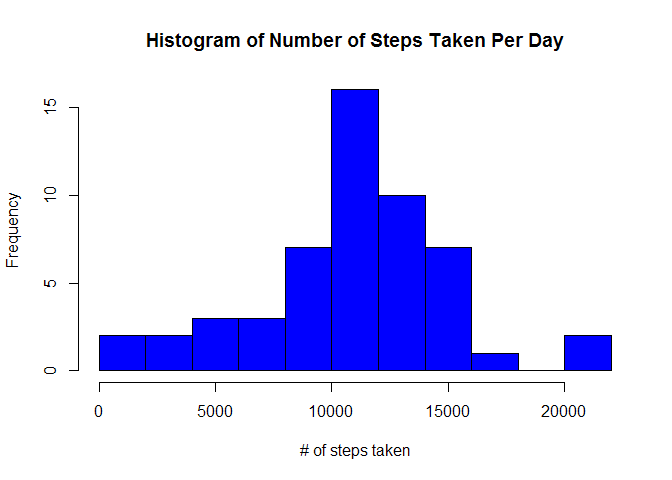
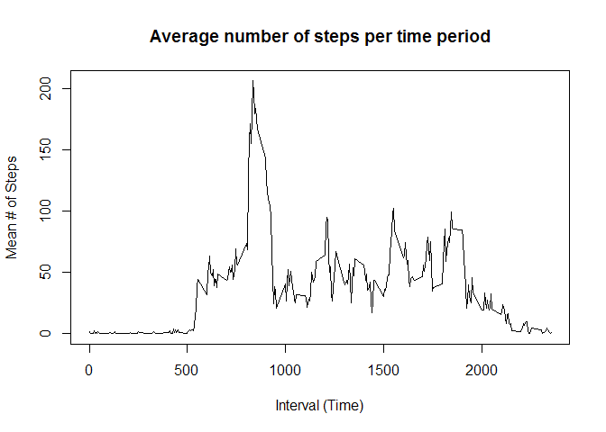
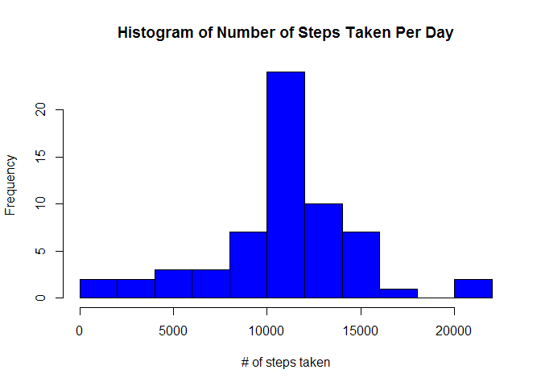
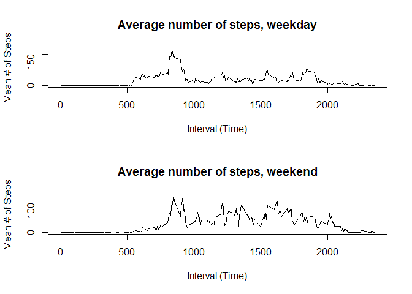

## 1. Code for reading in the dataset and/or processing the data
This code reads the data, formats the date, and removes any NA periods.

```r
### this function reads the data and formats the date
library(plyr)
library(timeDate)
```

```
## Warning: package 'timeDate' was built under R version 3.4.4
```

```r
par(mfrow = c(1,1))
url <- "https://d396qusza40orc.cloudfront.net/repdata%2Fdata%2Factivity.zip"
zipfile <- "activity.zip"
filename <- "activity.csv"

if(!file.exists(filename)) {
      download.file(url,destfile = zipfile)
      unzip(zipfile)
}
activity <- read.csv("activity.csv")
activity$date <- as.Date(activity$date)
```


The activity data follows the form:

```
##   steps       date interval
## 1    NA 2012-10-01        0
## 2    NA 2012-10-01        5
## 3    NA 2012-10-01       10
## 4    NA 2012-10-01       15
## 5    NA 2012-10-01       20
```
  
  
  
## 2. Histogram of the total number of steps taken each day  
The histogram of steps is plotted below:

```r
steps_day <- as.data.frame(with(activity,tapply(steps,date,sum)))
steps_day$date <- unique(activity$date)
colnames(steps_day) <- c("steps","date")
hist(steps_day$steps, xlab = "# of steps taken", col = "blue", main = "Histogram of Number of Steps Taken Per Day", breaks = 15)
```

<!-- -->
  

## 3. Mean and median number of steps taken each day
The mean and median of the total steps taken below are:  


```r
mean(steps_day$steps, na.rm = TRUE)
```

```
## [1] 10766.19
```

```r
median(steps_day$steps, na.rm = TRUE)
```

```
## [1] 10765
```

## 4. Time series plot of the average number of steps taken
The following code calculates and displays the average daily activity pattern.  

```r
p <- as.data.frame(with(activity,tapply(steps,interval,mean, na.rm = TRUE)))
p$x <- unique(activity$interval)
colnames(p) <- c("steps","interval")
plot(p$interval,p$steps, type = "l", xlab = "Interval (Time)", ylab = "Mean # of Steps", main = "Average number of steps per time period")
```

<!-- -->

## 5. The 5-minute interval that, on average, contains the maximum number of steps


```r
subset(p, steps == max(steps))
```

```
##        steps interval
## 835 206.1698      835
```
The maximum # of steps occurs in the interval 835 (8:35AM)


## 6. Code to describe and show a strategy for imputing missing data
1. The number of missing values in the dataset is:

```r
sum(is.na(activity$steps))
```

```
## [1] 2304
```
  
2. Devise a strategy for filling in all of the missing values in the dataset. The strategy does not need to be sophisticated. For example, you could use the mean/median for that day, or the mean for that 5-minute interval, etc.     
  *The missing data will be filled with the mean for that 5-minute interval.  
3. Create a new dataset that is equal to the original dataset but with the missing data filled in.

```r
activity_rm <- activity
for ( i in 1:17568 ) {
      if ( is.na(activity_rm[i,1]) ) {
            a <- activity_rm[i,3] 
            activity_rm[i,1] <- subset(p,interval == a)[1,1]
      }
}
```

## 7. Make a histogram of the total number of steps taken each day and Calculate and report the mean and median total number of steps taken per day. 
Do these values differ from the estimates from the first part of the assignment? What is the impact of imputing missing data on the estimates of the total daily number of steps?

```r
steps_day2 <- as.data.frame(with(activity_rm,tapply(steps,date,sum)))
steps_day2$date <- unique(activity_rm$date)
colnames(steps_day2) <- c("steps","date")
hist(steps_day2$steps, xlab = "# of steps taken", col = "blue", main = "Histogram of Number of Steps Taken Per Day", breaks = 15)
```

<!-- -->

```r
mean(steps_day2$steps)
```

```
## [1] 10766.19
```

```r
median(steps_day2$steps)
```

```
## [1] 10766.19
```
  
  *It can be seen from the above that the histogram has not changed visibly.
  *The mean is not changed.
  *The median has changed by imputing the data, and is now equal to the mean.


## 8. Panel plot comparing the average number of steps taken per 5-minute interval across weekdays and weekends

```r
activity_day <- data.frame(1:17568)
activity_day[,1] <- factor(c("weekend","weekday"))
colnames(activity_day) <- c("day")
for ( i in 1:17568 ) {
      if ( isWeekday(activity_rm$date[i]) ) {
            activity_day[i,1] <- "weekday"
      } else {
            activity_day[i,1] <- "weekend"
      }
}
activity_rm[,4] <- activity_day


weekdays <- subset(activity_rm, day == "weekday")
weekends <- subset(activity_rm, day == "weekend")
wd <- as.data.frame(with(weekdays,tapply(steps,interval,mean)))
we <- as.data.frame(with(weekends,tapply(steps,interval,mean)))
wd$x <- unique(activity$interval)
we$x <- unique(activity$interval)
colnames(wd) <- c("steps","interval")
colnames(we) <- c("steps","interval")

par(mfrow = c(2,1))
plot(wd$interval,wd$steps, type = "l", xlab = "Interval (Time)", ylab = "Mean # of Steps", main = "Average number of steps, weekday")
plot(we$interval,we$steps, type = "l", xlab = "Interval (Time)", ylab = "Mean # of Steps", main = "Average number of steps, weekend")
```

<!-- -->


